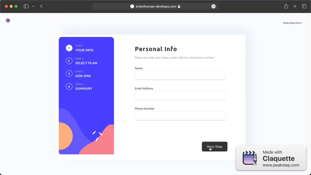

# Frontend Mentor - Multi-step form solution

This is a solution to the [Multi-step form challenge on Frontend Mentor](https://www.frontendmentor.io/challenges/multistep-form-YVAnSdqQBJ). Frontend Mentor challenges help you improve your coding skills by building realistic projects. 

## Table of contents

- [Overview](#overview)
  - [The challenge](#the-challenge)
  - [Screenshot](#screenshot)
  - [Links](#links)
- [My process](#my-process)
  - [Built with](#built-with)
  - [What I learned](#what-i-learned)
  - [Continued development](#continued-development)
  - [Useful resources](#useful-resources)
- [Author](#author)
- [Acknowledgments](#acknowledgments)

**Note: Delete this note and update the table of contents based on what sections you keep.**

## Overview

### The challenge

Users should be able to:

- Complete each step of the sequence
- Go back to a previous step to update their selections
- See a summary of their selections on the final step and confirm their order
- View the optimal layout for the interface depending on their device's screen size
- See hover and focus states for all interactive elements on the page
- Receive form validation messages if:
  - A field has been missed
  - The email address is not formatted correctly
  - A step is submitted, but no selection has been made

### Screenshot




## My process

### Built with

- CSS vaiables
- Flexbox
- CSS Grid
- Desktop-first workflow
- [React](https://reactjs.org/) - JS library
- [Gatsby JS](https://www.gatsbyjs.com) - React framework

### What I learned

The most valuable lesson learned while bulding this project was how I inplement GSAP timelines in React. 

I learned that keeping the timeline and it's control buttons/links in the same file the timeline is defined in is how the animation does not reset or become invalidated with re-renders and state changes.

Index.js
```Index.JS
let tl = gsap.timeline({ .. }
useEffect(() => { ...
    tl.add("step1") ...
    
    define all buttons/links that will control the animation timeline
}
```

### Continued development

In the future I plan to improve this solution to include more micro-interactions and including those using animation functions built with GSAP.

## Author

- Website - [Brian Thomas](https://www.brianthomas-develops.com)
- Frontend Mentor - [@joyreacher](https://www.frontendmentor.io/profile/joyreacher)